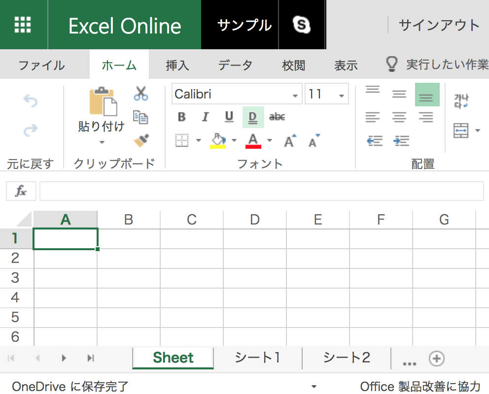

# createxlsxsheets

指定した接頭辞 + 連番のシートを追加して、エクセルファイルを作成します。
例えばファイル名が [サンプル.xlsx] 、シート名が [Sheet], [シート1], [シート2], ... [シート54] のファイルが生成されます。

## 使い方
```bash
pip install -r requirements.txt
# createxlsxsheets.py を編集
# ファイル名: dest_filename = 'サンプル.xlsx'
# シート接頭辞: prefix = 'シート'
# シート数(第 2 引数 -1 が作成されるシート数): serial_numbers = range(1, 55)
# 上記例で次を実行すると、
# ファイル名が [サンプル.xlsx]
# シート名が [Sheet], [シート1], [シート2], ... [シート54]
# の xlsx ファイルが生成される。
python createxlsxsheets.py
```

## 補足。使い方、の前の準備
```bash
git clone https://github.com/oki2a24/createxlsxsheets.git
cd createxlsxsheets
python3 -m venv venv
# Mac の場合
source venv/bin/activate
# 以上を行った後、使い方へ続く。
```
